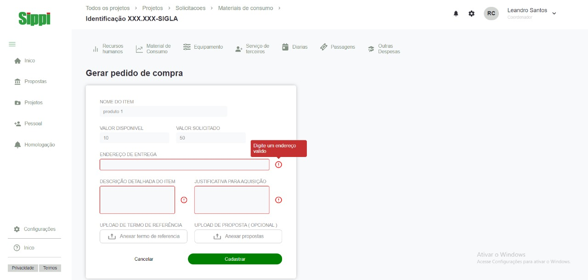

<h1 align='center'>Sippi</h1>

<Br> <Br>

<p>Desafio de react para ingressar no projeto Sippi</p>


## 🛠 Tecnologias | Dependências

<p>Principais ferramentas que foram usadas na construção do projeto</p>

<h3>Tecnologias</h3>

✅ Reactjs <br>
✅ Typescript <br>
✅ styled-components <br>
✅ React-Router-Dom <br>
✅ Unform <br>


## <h4 align="center"> 
    🚀 Landing-page concluida

## pré-requisito

Antes de começar, você vai precisar ter instalado em sua máquina as seguintes ferramentas: 

[Git](https://git-scm.com) e [Node.js](https://nodejs.org/en/)

Além disso é bom ter um editor para executar o código como [VsCode](https://code.visualstudio.com/download)

### 🎲 Rodando o projeto

```bash

#clone este repositório

$ git clone https://github.com/LeandroSannt/Desafio-sippi-react.git

## acesse a pasta do projeto no terminal/cmd

$ cd Desafio-sippi-react

## instale as dependencias 

$ yarn install

## execute a aplicação em modo de desenvolvimento 

$ yarn start

# O servidor iniciará na porta:3000, acesse <http://localhost:3000>

```
